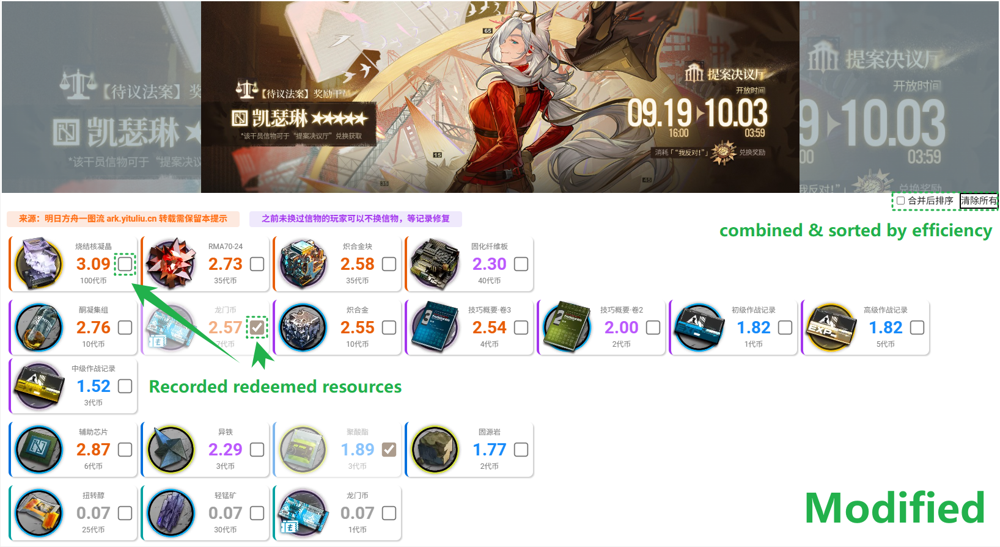

# Arknights YiTuLiu Store Optimizer

A Tampermonkey userscript to annotate redeemed events' in-game resources for a popular third-party support website for the Arknights mobile game.

**Highlighted features**
- ✅ **Track redeemed items**: Add checkboxes to record event resources (stored in `localStorage` so progress persists after refresh).
- 🌟🚀 **Smart resource prioritization**: Automatically combine and sort resources by efficiency, highlighting the best redemption choices.
- 🔄 **Multi-event support**: Handle multiple overlapping events seamlessly (even if rare).

